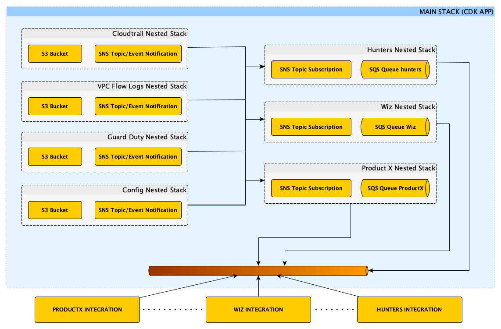

# CDK PROJECT FOR HUNTERs, WIZ AND FUTURE ADDITIONALs INTEGRATIONs
---

## Description

This project is created for the deployment of the main elements that allow
the integration with Hunter, Wiz and other future products supporting integration
via the indicated described design in next section:

- S3 Bucket Logs (Creation or import supported)
- SNS Topics allowing the *"FanOut"* to corresponding SQS Queues for integrations purposes
- SQS Queues receiving notifications via SNS Subscriptions
- S3 Event notification to SNS Topics for the object creation
- SQS Subscriptions to the SNS Topics

## "*Architecture Design*"

The main architecture follows the next general schema:

From a first monolithic version design, it was implemented using nested stack with L2 Basic *"Construtcs"*, a modular version:

*Notes:*:
  - Although SnsToSQS Constructs exists in the AWS Constructs HUB, the current status is experimental and
    it was discarded as viable implementation. From a support point of view it would be *"problematic"*.

## Future Tasks

- CDK Pipelines for deployment (In-Progress)
- Include a Tool to make easier daily operations and automatic compliance analysis. (In Progress)

## Requirements

The main requirements to run this project are:

- Access to an AWS Account/Environment
- AWS CDK (or alternative) configured on the *"HOST"* running the project
- AWS CLI (or alternative) configured ton the *"HOST"* running the project

## Useful commands

|COMMAND|DESCRIPTION|
|:---:|:---:|
|`npm install`|Generate all the node modules and projects according package.json|
|`npm run build`|Compile typescript to js|
|`npm run watch`|Watch for changes and compile|
|`npm run test`|Perform the jest unit tests|
|`cdk deploy`|Deploy this stack to your default AWS account/region|
|`cdk destroy`|Remove the created resources for the implemented stacks|
|`cdk diff`|Compare deployed stack with current state|
|`cdk synth`|Emits the synthesized CloudFormation template|
